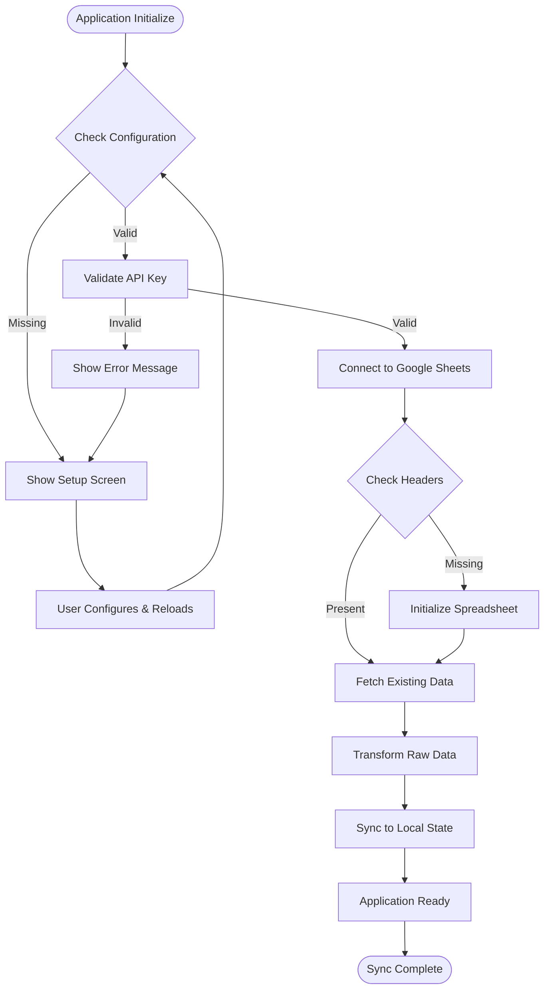

# Software Architecture Document
**Small Business Financial Tracker with Google Sheets Integration**

---

## Table of Contents
1. [High-Level Application Overview](#high-level-application-overview)
2. [System Architecture](#system-architecture)
3. [Component Architecture](#component-architecture)
4. [Data Models](#data-models)
5. [Core Workflows](#core-workflows)
6. [Technology Stack](#technology-stack)
7. [External Integrations](#external-integrations)
8. [Security Architecture](#security-architecture)
9. [Performance Considerations](#performance-considerations)
10. [Deployment Architecture](#deployment-architecture)

---

## High-Level Application Overview

### Purpose
The Small Business Financial Tracker is a cloud-native financial management platform designed specifically for small retail businesses, particularly watch resellers. It provides real-time financial analytics, inventory management, and transaction tracking with Google Sheets as the persistent data storage backend.

### Key Capabilities
- **Real-time Transaction Management**: Record sales and expenses with immediate Google Sheets synchronization
- **Financial Analytics Engine**: Calculate ROI, profit margins, inventory turnover, and business performance metrics
- **Inventory Management**: Track stock levels with automatic updates and overselling prevention
- **Cloud Data Persistence**: Leverage Google Sheets for data storage, backup, and cross-platform accessibility
- **Visual Analytics**: Interactive charts and dashboards for business insights
- **Multi-device Support**: Responsive design for desktop, tablet, and mobile usage

### Target Users
- **Primary**: Small business owners (watch resellers, retail entrepreneurs)
- **Secondary**: Business accountants, financial advisors, and stakeholders

---

## System Architecture

### High-Level System Diagram


### Architecture Patterns
- **Component-Based Architecture**: React functional components with hooks for state management
- **Service-Oriented Design**: Separation of concerns with dedicated service classes
- **Render Props Pattern**: GoogleSheetsManager uses render props for flexible integration
- **Repository Pattern**: GoogleSheetsService abstracts data access operations
- **Observer Pattern**: React hooks for state synchronization across components

---

## Component Architecture

### Frontend Component Hierarchy


### Core Components

#### 1. **App.tsx** (Main Application Container)
- **Purpose**: Root application component and main business logic
- **Responsibilities**:
  - State management for business settings
  - Financial calculations and analytics
  - Modal state management
  - Data transformation and aggregation
- **Key Features**:
  - React hooks for state management
  - Memoized calculations for performance
  - Event handling for CRUD operations

#### 2. **GoogleSheetsManager.tsx** (Integration Wrapper)
- **Purpose**: Manages Google Sheets integration and provides setup UI
- **Responsibilities**:
  - Configuration validation
  - Setup wizard for unconfigured instances
  - Error handling and user feedback
  - Loading states and sync indicators
- **Pattern**: Render Props for flexible child component integration

#### 3. **useGoogleSheets.ts** (Data Management Hook)
- **Purpose**: Custom React hook for Google Sheets operations
- **Responsibilities**:
  - CRUD operations (Create, Read, Update, Delete)
  - State synchronization between UI and Google Sheets
  - Error handling and loading states
  - Data validation and ID generation

#### 4. **GoogleSheetsService.ts** (Data Access Layer)
- **Purpose**: Service class for Google Sheets API interactions
- **Responsibilities**:
  - Google Sheets API communication
  - Data serialization/deserialization
  - Batch operations and performance optimization
  - Error handling and retry logic

---

## Data Models

### Core Data Entities


### Data Model Specifications

#### **TransactionRow Interface**
```typescript
interface TransactionRow {
  id: string;           // Unique identifier (timestamp + random)
  date: string;         // ISO timestamp
  amount: number;       // Dollar amount (positive)
  type: 'sale' | 'expense'; // Transaction type
  quantity?: number;    // Items sold (sales only)
  description: string;  // Transaction description
}
```

#### **Business Settings Interface**
```typescript
interface SettingsType {
  initialInvestment: number; // Initial capital investment
  watchCost: number;        // Cost per unit (COGS)
  watchPrice: number;       // Selling price per unit
}
```

#### **Financial Analytics Interface**
```typescript
interface FinancialData {
  totalSales: number;     // Sum of all sales revenue
  totalExpenses: number;  // Sum of all expenses
  cogs: number;          // Cost of goods sold
  grossProfit: number;   // Revenue - COGS
  netProfit: number;     // Gross profit - expenses - initial investment
  roi: number;           // Return on investment percentage
  profitMargin: number;  // Gross profit margin percentage
}
```

### Data Flow Architecture


---

## Core Workflows

### 1. Transaction Recording Workflow


### 2. Financial Analytics Calculation Workflow


### 3. Google Sheets Synchronization Workflow



### 4. Data Persistence Workflow


---

## Technology Stack

### Frontend Technology Stack


### Detailed Technology Specifications

#### **Frontend Framework**
- **React 19.1.0**: Modern functional components with hooks
- **TypeScript 5.7.2**: Static typing for enhanced developer experience
- **JSX/TSX**: Component-based UI development

#### **Build System**
- **Vite 6.2.0**: Fast development server and optimized production builds
- **ES Modules**: Modern JavaScript module system
- **Hot Module Replacement**: Development-time hot reloading

#### **UI Libraries**
- **Lucide React 0.525.0**: Consistent iconography system
- **Recharts 3.0.2**: Interactive chart components
- **Custom CSS**: Tailwind-style utility classes for responsive design

#### **State Management**
- **React Hooks**: useState, useEffect, useMemo, useCallback
- **Custom Hooks**: useGoogleSheets for data management
- **Context-free Architecture**: Simplified state management

#### **External Integrations**
- **Google APIs 150.0.1**: Official Google services integration
- **Google Auth Library 10.1.0**: Authentication and authorization
- **Google Sheets API v4**: Spreadsheet data operations

---

## External Integrations

### Google Sheets Integration Architecture


### Integration Specifications

#### **API Authentication**
- **Method**: API Key-based authentication
- **Security**: Restricted to Google Sheets API only
- **Environment**: Stored in environment variables
- **Validation**: Runtime configuration validation

#### **Data Operations**
- **Create**: `sheets.spreadsheets.values.append()`
- **Read**: `sheets.spreadsheets.values.get()`
- **Update**: `sheets.spreadsheets.values.update()`
- **Delete**: `sheets.spreadsheets.batchUpdate()` with row deletion

#### **Rate Limiting & Performance**
- **Google API Quotas**: 100 requests per 100 seconds per user
- **Batch Operations**: Minimize API calls through batch processing
- **Caching Strategy**: Local state management to reduce API calls
- **Error Handling**: Exponential backoff for rate limit errors

---

## Security Architecture

### Security Layers


### Security Measures

#### **API Key Security**
- **Environment Storage**: Never exposed in client-side code
- **API Restrictions**: Limited to Google Sheets API only
- **Version Control**: Excluded from repository commits
- **Development**: Separate keys for development and production

#### **Data Protection**
- **HTTPS Only**: All communications encrypted in transit
- **Input Validation**: All user inputs validated and sanitized
- **Type Safety**: TypeScript prevents type-related vulnerabilities
- **SQL Injection Prevention**: N/A (using Google Sheets, not SQL)

#### **Access Control**
- **Google Sheets Permissions**: Controlled via Google's sharing settings
- **Public Read Access**: Sheets accessible via link but not discoverable
- **API-only Write**: Application writes through API, not direct sheet access
- **Audit Trail**: All changes tracked with timestamps and user context

---

## Performance Considerations

### Performance Optimization Strategies


### Performance Metrics

#### **Frontend Performance**
- **First Contentful Paint**: Target < 1.5 seconds
- **Time to Interactive**: Target < 3 seconds
- **Bundle Size**: Optimized through Vite tree shaking
- **Memory Usage**: Efficient React component lifecycle

#### **API Performance**
- **Response Time**: Google Sheets API typically < 500ms
- **Throughput**: Limited by Google API quotas
- **Caching**: Local state reduces redundant API calls
- **Batch Operations**: Multiple operations combined when possible

#### **Data Performance**
- **Large Datasets**: Pagination or virtualization for >1000 transactions
- **Real-time Updates**: Optimistic UI updates with error rollback
- **Memory Management**: Proper cleanup of event listeners and subscriptions

---

## Deployment Architecture

### Deployment Pipeline


### Deployment Specifications

#### **Build Process**
- **Static Site Generation**: Vite generates optimized static assets
- **Environment Variables**: Injected at build time for client-side usage
- **Asset Optimization**: Automatic minification, compression, and optimization
- **TypeScript Compilation**: Type checking and transpilation to JavaScript

#### **Hosting Options**
- **Vercel** (Recommended): Zero-config deployment with GitHub integration
- **Netlify**: Alternative with similar features and performance
- **AWS S3 + CloudFront**: Enterprise-grade scalability and custom domains
- **GitHub Pages**: Free hosting for open-source projects

#### **Environment Management**
- **Development**: Local `.env.local` file with development API keys
- **Production**: Platform-specific environment variable configuration
- **Security**: Separate API keys for each environment
- **Configuration**: Runtime environment detection

#### **Monitoring & Analytics**
- **Error Tracking**: Browser console monitoring for production issues
- **Performance Monitoring**: Web Vitals and user experience metrics
- **Usage Analytics**: User interaction patterns and feature adoption
- **API Monitoring**: Google Sheets API usage and error rates

---

## Conclusion

This architecture document provides a comprehensive overview of the Small Business Financial Tracker's technical design and implementation. The system follows modern web development best practices with a focus on:

- **Separation of Concerns**: Clear boundaries between UI, business logic, and data access
- **Type Safety**: TypeScript throughout the application for enhanced reliability
- **Performance**: Optimized rendering and minimal API calls
- **Security**: Proper API key management and data protection
- **Scalability**: Architecture supports growth and feature expansion
- **Maintainability**: Clean code structure and comprehensive documentation

The system successfully combines React's component-based architecture with Google Sheets' cloud storage capabilities to deliver a robust, accessible, and user-friendly financial management solution for small businesses.

---

**Document Version**: 1.0  
**Last Updated**: July 1, 2025  
**Next Review**: July 15, 2025  
**Author**: Senior Software Architect  
**Reviewers**: Product Team, Development Team
